# SegundaJugada-POO

¡Bienvenido/a a **SegundaJugada-POO**!  
Este proyecto es una **página de compraventa de segunda mano especializada en productos de baloncesto**. Aquí los usuarios pueden comprar y vender artículos deportivos de baloncesto, encontrar productos populares, destacados y mucho más, todo en un entorno web atractivo y funcional.

---

## ¿De qué trata el proyecto?

SegundaJugada-POO es una plataforma web orientada a la compraventa de productos de baloncesto de segunda mano.  
Permite a los usuarios:
- Publicar anuncios de productos ***(no disponible por el momento)***.
- Buscar, filtrar y visualizar artículos.
- Acceder a productos destacados, populares y con mejor valoración.
- Iniciar sesión tanto como usuario local, usuario de google , o usuario de gitbub .

---

## ⚙️ Tecnologías utilizadas

El proyecto divide las tecnologías entre **Frontend** y **Backend** y usa tecnolgía de **POO** ***(programación orientada a objetos)***.

---

### ✨ Frontend

<table>
  <tr>
    <td align="center">
      <br/>
      <b>JavaScript</b>
    </td>
    <td align="center">
      <br/>
      <b>jQuery</b>
    </td>
    <td align="center">
      <br/>
      <b>HTML5</b>
    </td>
    <td align="center">
      <br/>
      <b>CSS3</b>
    </td>
  </tr>
</table>

**Librerías y plugins destacados**:
- **Owl Carousel**: Carruseles de productos.
- **SweetAlert2**: Alertas y modales bonitos.
- **jQuery UI**: Componentes de interfaz avanzada.
- **FontAwesome**: Iconografía.
- **Toastr**: Notificaciones emergentes.

---

### 🛢️ Backend

<table>
  <tr>
    <td align="center">
      <br/>
      <b>PHP</b>
    </td>
    <td align="center">
      <br/>
      <b>MySQL</b>
    </td>
  </tr>
</table>

**Características del backend**:
- Gestión de rutas y módulos.
- Autenticación JWT.
- Conexión y consultas con MySQL.
- Utilidades para el envío de emails y mensajes de whatsapps.

---

## 📸 Imágenes de ejemplo
- En la vista principal de la web ***(home)*** podemos observar varios carruseles sobre diferentes productos en la web
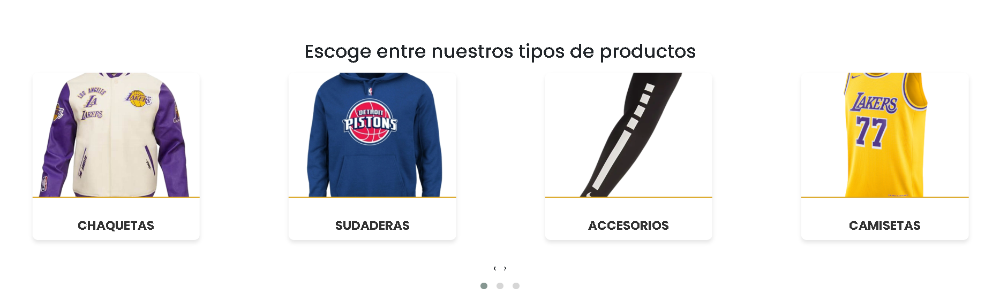
- Al estar 30 minutos inactivo se te cierra la sesión por seguridad
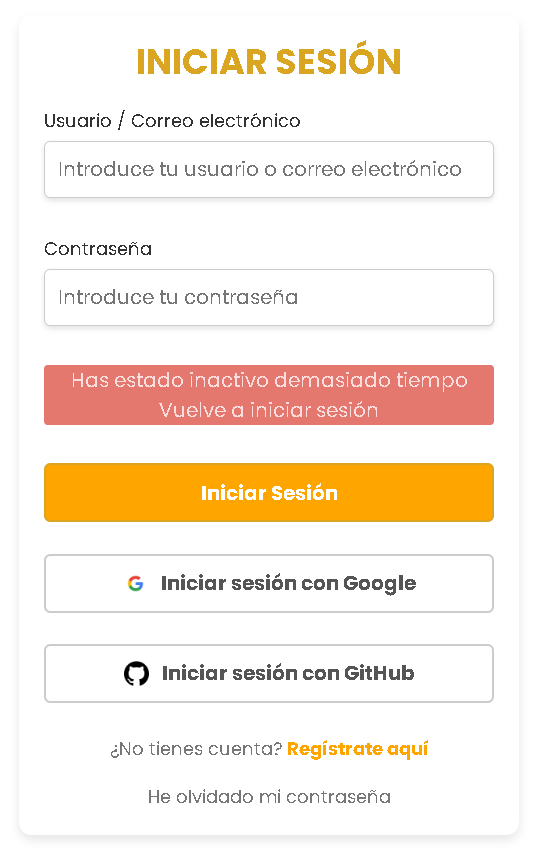
- Paginación en el apartado del shop donde puedes ir cambiando de página para ver los diferentes productos
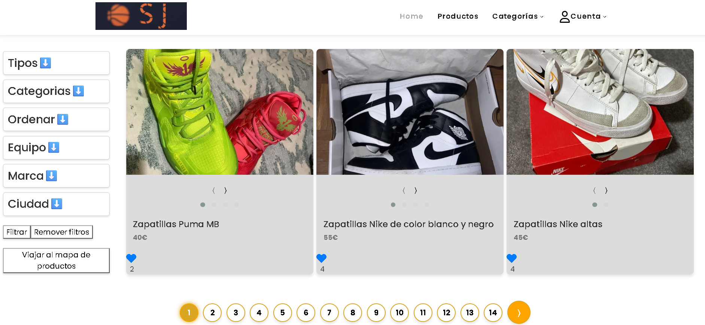
- Puedes filtrar productos según tus necesidades con las casillas desplegables situadas al lado de los productos en el shop<br>
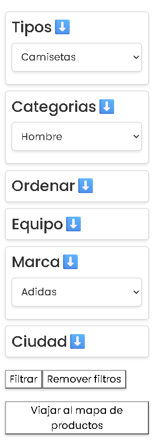
- Abajo de los productos puedes ver un mapa para ver donde esta ubicado cada producto
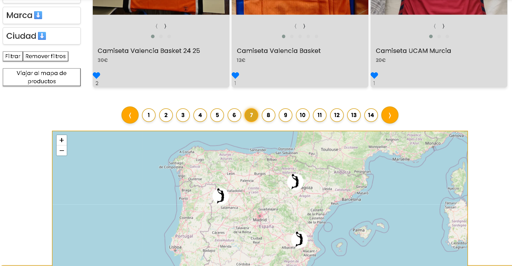
- En la vista de los detalles de un producto se pueden encontrar diferentes cosas sobre el producto, podemos encontrar las imágenes del producto en un carrusel para poder ir pasandolas, podemos ver el avatar y nombre de usuario a quien pertenece dicho producto, también podemos ver la valoración que tiene en estrellas y cuantos likes tiene el producto ademas de en la parte baja de los detalles del producto donde podemos ver los extras que tiene cada producto como por ejemplo saber si el producto admite envío o solamente admite venta en persona dependiendo de si el primer icono es un camión o una persona a parte de los de poder ver los demás extras como ver al lado del icono de la ubicación donde se situa el producto
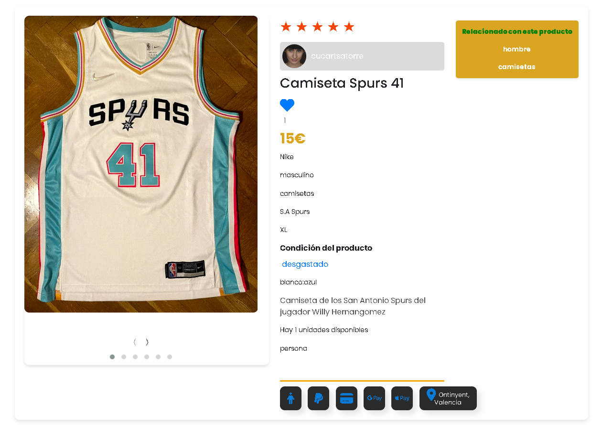
- Si deslizamos más hacia abajo en el details podemos ver como tenemos una sección de productos relacionados con el producto que estemos viendo en dicho momento
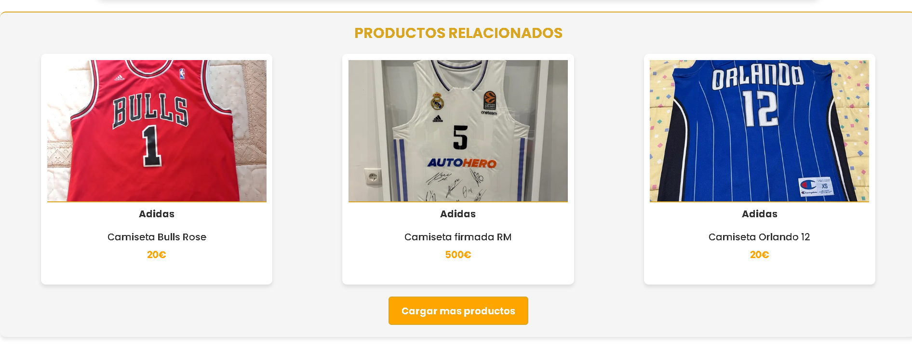
- Por último en los detalles del producto, abajo del todo hay un mapa donde se puede ver donde esta úbicado el producto con más exactitud que en la vista del shop ya que se ve con más zoom la ubicación del producto
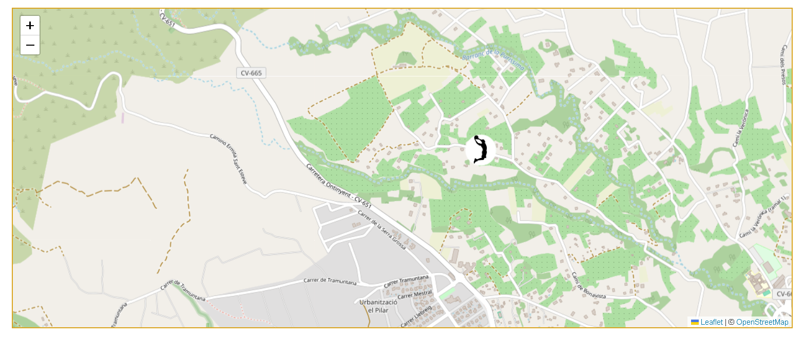
- En la parte superior de la web se puede ver un buscador en el que podemos filtrar productos por su tipo categoria y ciudad para buscar más precisamente lo que el cliente desea
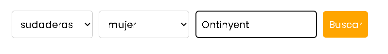
**Tenemos dos formas de ver el menú de la web las cuales son:**<br>
- Al no tener sesión iniciada<br>
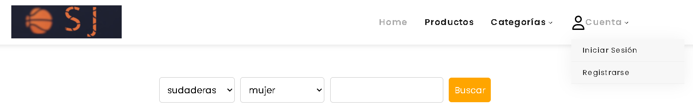
- Al tener la sesión iniciada<br>
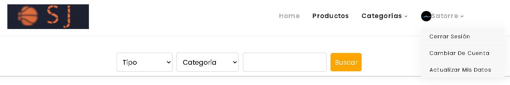

## 📁 Estructura del proyecto
- El proyecto esta realizado con el framework ***ORM*** *(object-relational mapping)*

```
/model         # Lógica de datos y conexión a la base de datos (PHP)
/module        # Módulos por funcionalidades (home, shop, auth, etc.)
/view          # Archivos estáticos: HTML, CSS, JS, imágenes
/utils         # Utilidades para el proyecto
/router        # Lógica de enrutamiento
/DB            # Archivos de la base de datos
```

---

## 📥 Instalación y despliegue

1. Clona el repositorio:
   ```bash
   git clone https://github.com/danisatorre/SegundaJugada-POO.git
   ```
2. Configura el servidor web (preferiblemente Apache) y la base de datos MySQL.
3. Importa en tu servidor **MySQL** o **MariaDB**
4. Ajusta los archivos de configuración de conexión según tus credenciales.
5. Recuerda que debes de añadir los archivos ***.ini*** con tus credenciales para que el proyecto funcione correctamente y el archivo ***FBsecret.js*** dentro de la carpeta utils con tus credenciales de firebase para poder logearse con usuarios de redes sociales
6. Los archivos ***.ini*** ha añadir con tus credenciales son los siguientes:
```
utils/db.ini        # Credenciales para acceder a la base de datos
utils/jwt.ini       # Almacenar el header y el secret que usa JWT
utils/resend.ini    # Almacenar las la APIKEY de resend para enviar emails
utils/ultramsg.ini  # Almacenar el token y la instancia de ultramsg
```
- Estructura de los diferentes archivos ***.ini***<br>
- ⚠️ **Importante** ⚠️ *Recuerda cambiar las credenciales en los archivos por las tuyas*<br><br>
- **db.ini**<br>
```ini
[db]
DB_HOST = ""
DB_USER = ""
DB_PWD = ""
DB_DB = ""
DB_PORT = 
```
- **jwt.ini**
```ini
JWT_HEADER='{"typ":"JWT", "alg":"HS256"}'
JWT_SECRET=
```
- **resend.ini**
```ini
RESEND_APIKEY=
```
- **ultramsg.ini**
```ini
ULTRAMSG_TOKEN=
ULTRAMSG_INSTANCE_ID=
```
7. Pasos de como configurar el archivo ***FBsecret.js***
- Añade el archivo **FBsecret.js** dentro de la carpeta **utils**
```
utils/FBsecret.js
```
- El archivo **FBsecret.js** debe de seguír la siguiente estructura
```js
function firebase_config(){
    const firebaseConfig = {
        apiKey: "",
        authDomain: "",
        projectId: "",
        storageBucket: "",
        messagingSenderId: "",
        appId: "",
        measurementId: ""
    };
    if(!firebase.apps.length){
        firebase.initializeApp(firebaseConfig);
    }else{
        firebase.app();
    }
    return authService = firebase.auth();
}
```
8. Accede a la web desde tu navegador mediante localhost.

---

>**¡Gracias por visitar SegundaJugada-POO!**